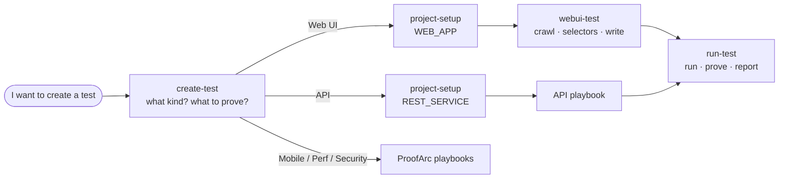

# ProofArc for Claude Code

Skills that guide your agent through testing with [ProofArc](https://proofarc.ai) over MCP — from "I want to create a test" to a green, re-runnable test and a report. Written for people **using** ProofArc, not for developing it.

## Install

```
/plugin marketplace add proofarc/mcp-skills
/plugin install proofarc@proofarc
```

Start a new session afterwards so the skills load.

**You also need the ProofArc MCP server connected** (`/mcp` should list it). The skills drive its tools; without it they'll tell you it isn't connected and stop.

## Skills

| skill | job |
|---|---|
| `create-test` | Starts every request. Works out what kind of test (web UI, API, mobile, performance, security) and what it should prove — asks when that's unclear — then hands off. |
| `project-setup` | Makes sure the project, application, environment and target exist (and a login credential, if needed). Reuses what's there; creates only what's missing. |
| `webui-test` | Reuses a recent crawl of the site (or crawls it), takes selectors from the crawl, and writes one validated Playwright test per behaviour. |
| `run-test` | Runs the tests, proves each assertion can fail, and renders a report. |



## Try it

- *"I want to create a test"* — it asks what kind.
- *"test https://practicesoftwaretesting.com"* — it asks what to check, then sets up and builds it.
- *"add a test to project <name> that the contact page shows the email field"* — it reuses the existing setup and adds one test.

## What the skills insist on

- Selectors come from a crawl, never from guesses.
- Credentials live in the environment's vault and are referenced by tag — never written into a test.
- Tests are read-only unless you ask otherwise.
- Every assertion is made to fail once before it's trusted.
- A red test is a finding: the skills report it and never loosen the test to make it pass.

## Layout

```
.claude-plugin/marketplace.json        # this repo is a marketplace
plugins/proofarc/.claude-plugin/plugin.json
plugins/proofarc/skills/<skill>/SKILL.md
```

Check changes with `claude plugin validate .` and `claude plugin validate ./plugins/proofarc`.
