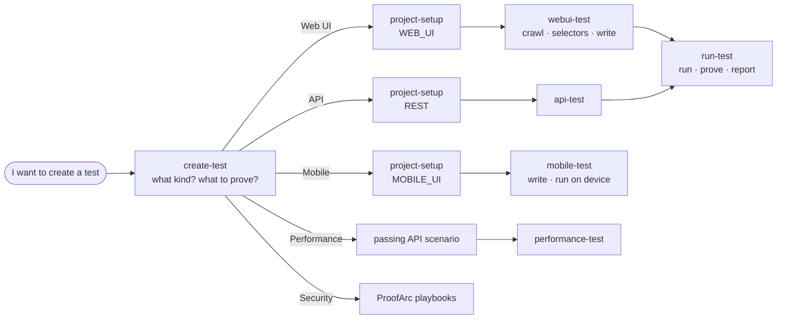

# ProofArc for Claude Code

Skills that guide your agent through testing with [ProofArc](https://proofarc.ai) over MCP — from "I want to create a test" to a green, re-runnable test and a report. Written for people **using** ProofArc, not for developing it.

## Get started

**You need:**
- [Claude Code](https://claude.com/claude-code)
- your ProofArc address, for example `https://ui-<company>.proofarc.ai`
- a ProofArc username and password with the ANALYST role; your ProofArc contact sends these
- macOS or Linux with `bash` and `python3` (on Windows, use WSL or Git Bash)

**1. Install the plugin.** In Claude Code, type:

```
/plugin marketplace add proofarc/proofarc-mcp-skills
/plugin install proofarc-skills@proofarc
```

**2. Connect to your ProofArc.** Ask Claude *"connect me to ProofArc"*. It gives you a command like this one to run **in your own terminal**:

```
bash <path>/connect-proofarc.sh https://ui-<company>.proofarc.ai
```

Enter your username and password when asked. The password isn't shown or saved.

**3. Restart Claude Code**, then ask *"list my ProofArc projects"*. Seeing your projects means you're ready.

**Later:**
- If ProofArc tools start answering *401 / unauthorized*, run the connect command again and restart Claude Code.
- To get skill updates, run `/plugin marketplace update proofarc` in Claude Code and restart it.

## Skills

| skill | job |
|---|---|
| `create-test` | Starts every request. Works out what kind of test (web UI, API, mobile, performance, security) and what it should prove — asks when that's unclear — then hands off. |
| `project-setup` | Makes sure the project, application, environment and target exist (and a login credential, if needed). Reuses what's there; creates only what's missing. |
| `webui-test` | Reuses a recent crawl of the site (or crawls it), takes selectors from the crawl, and writes one validated Playwright test per behaviour. |
| `api-test` | Finds the API spec, reads only the operations needed, and writes one validated scenario per behaviour, with logins by tag. |
| `mobile-test` | Registers the app on the device farm, takes element ids from the uploaded build, writes the test, and runs it on a real device. |
| `performance-test` | Turns a passing API scenario into a load test with response-time and error-rate limits, dry-runs it, runs it, and reports p95 and errors. |
| `run-test` | Runs the tests and proves each assertion can fail. |
| `connect` | Connects Claude Code to a ProofArc instance, or reconnects when tools answer 401. |
| `test-report` | Builds a report of any runs — a built-in layout or one you describe (with a branded starter template) — rendered by the platform. |



## Try it

- *"I want to create a test"* — it asks what kind.
- *"test https://practicesoftwaretesting.com"* — it asks what to check, then sets up and builds it.
- *"add a test to project <name> that the contact page shows the email field"* — it reuses the existing setup and adds one test.

## What the skills insist on

- Selectors come from a crawl, never from guesses.
- Credentials live in the environment's vault and are referenced by tag — never written into a test.
- Tests are read-only unless you ask otherwise.
- Every assertion is made to fail once before it's trusted.
- A red test is a finding: the skills report it and never loosen the test to make it pass.

## For maintainers

```
.claude-plugin/marketplace.json        # this repo is a marketplace
plugins/proofarc-skills/.claude-plugin/plugin.json
plugins/proofarc-skills/skills/<skill>/SKILL.md
```

Check changes with `claude plugin validate .` and `claude plugin validate ./plugins/proofarc-skills`.

## License

MIT. See [LICENSE](LICENSE).
